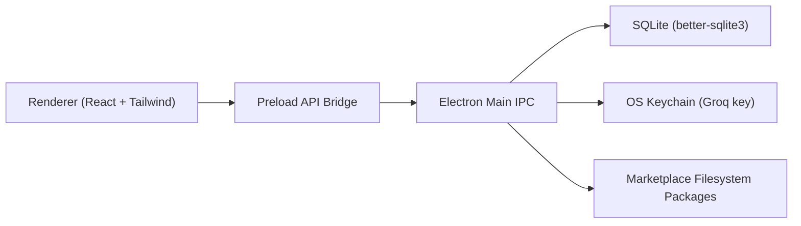

# AMP

**AMP** stands for **All My Prompts**.

AMP is a desktop-first prompt operations app for creating, validating, packaging, and shipping reusable prompts. It blends editorial readability with production tooling so creators can go from rough prompt draft to shareable asset without juggling multiple tools.

## What You Can Do

- Write prompts in a focused three-column workspace.
- Read prompts like content cards before choosing to edit.
- Improve and validate prompts with Groq (optional API key).
- Convert any prompt into a reusable template.
- Share/import prompts and selected bundles with validation gates.
- Build and edit plugin/theme manifests visually and as JSON.
- Import plugin/theme manifests by:
  - Paste JSON
  - Marketplace URL
  - Local manifest file
  - Local folder (`manifest.json`)
- Export plugin/theme manifests as files.
- Open plugin/theme package folders for advanced editing.

## Why AMP Exists

Most prompt tooling has one of two problems:

1. It is too lightweight for serious prompt workflows.
2. It is too complex for everyday creators.

AMP solves this by keeping the UI clear while preserving advanced workflows for templates, sharing, validation, plugins, and themes.

## Product Direction

AMP is built for the next stage: creator distribution.

- Prompt packs
- Template bundles
- Utility plugins
- Visual theme packs

The app already supports manifest-based packaging and strict validation so future marketplace publishing can be safe, repeatable, and monetizable.

## App Architecture



## Security Model

- Plugin permissions are allow-listed.
- Plugin entry paths are sanitized.
- Theme token keys/values are sanitized.
- Dangerous CSS patterns (for example `url(`, `@import`, `expression(`) are rejected.
- HTTPS-only homepages are enforced in normalized manifests.
- Prompt sharing/export enforces required metadata validation.
- Groq API keys are stored through OS keychain integration.

## Run Locally

```bash
npm install
npm run dev
```

### Build

```bash
npm run build
```

### Typecheck

```bash
npm run typecheck
```

### Tests

```bash
npm test
```

`npm test` now rebuilds `better-sqlite3` for Node before running Vitest, and `npm run dev` rebuilds native modules for Electron before launch.  
If you ever need to force it manually:

```bash
npm run rebuild:node
npm run rebuild:native
```

## Project Layout

- `src/main`: Electron main process, IPC handlers, DB repositories, security.
- `src/preload`: typed bridge API between renderer and main.
- `src/renderer`: React UI, features, dialogs, legal pages, theme system.
- `src/shared`: runtime contracts, DTOs, and validation rules.
- `docs`: static marketplace prototype and wiki pages.

## Marketplace Prototype (GitHub Pages Ready)

`docs/index.html` is a static showcase prototype for theme/plugin submissions inspired by Tailwind’s showcase style.

It supports:

- Resource cards
- Light/dark token previews
- Submission form (title, description, image, manifest JSON)
- JSON export for individual manifests and full listing

## Documentation

- [Contributing](./CONTRIBUTING.md)
- [Quick Contribute Alias](./contribute.md)
- [Wiki Home](./docs/wiki/Home.md)
- [Wiki: Themes and Plugins](./docs/wiki/Themes-And-Plugins.md)
- [Terms of Service UI Page](./src/renderer/features/legal/TermsOfServicePage.tsx)
- [About UI Page](./src/renderer/features/legal/AboutPage.tsx)

## License

MIT. See [LICENSE](./LICENSE).
