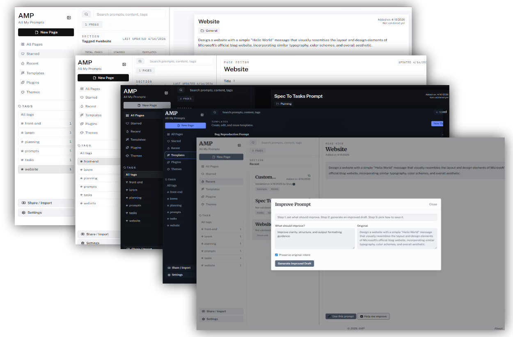
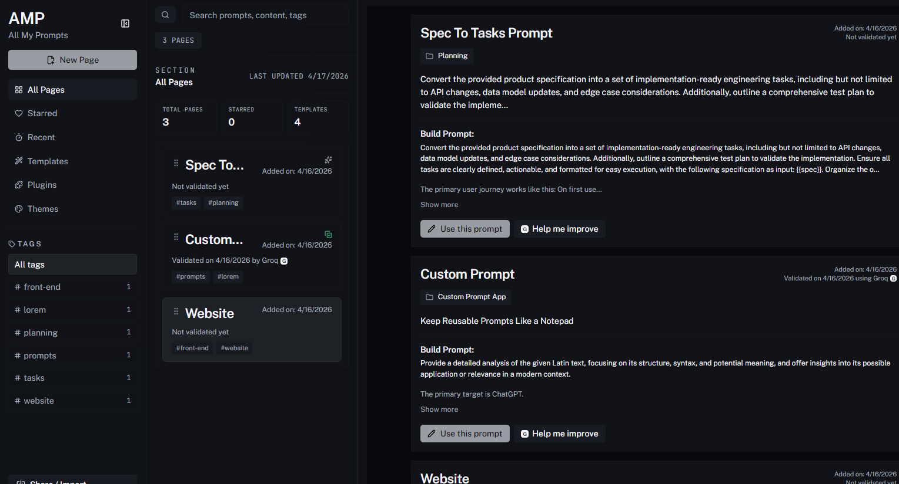
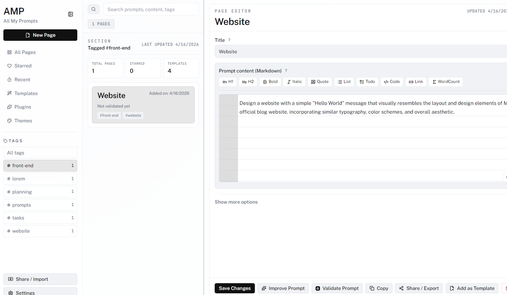
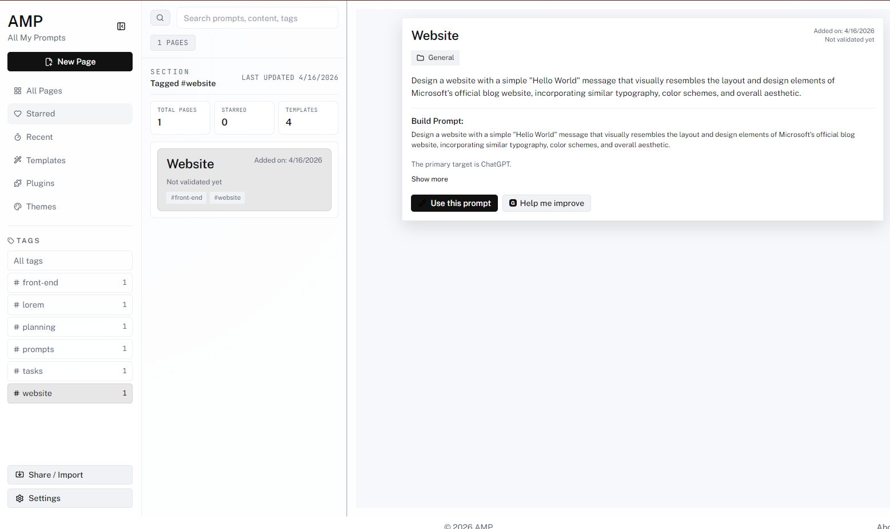
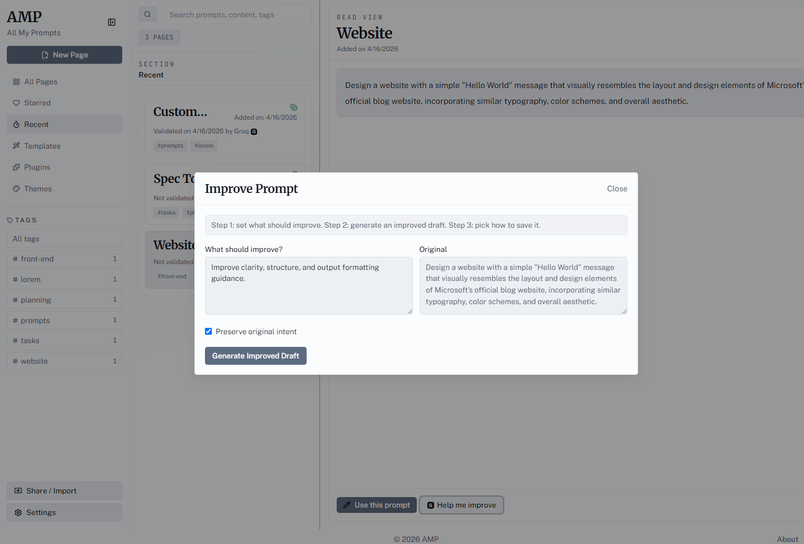
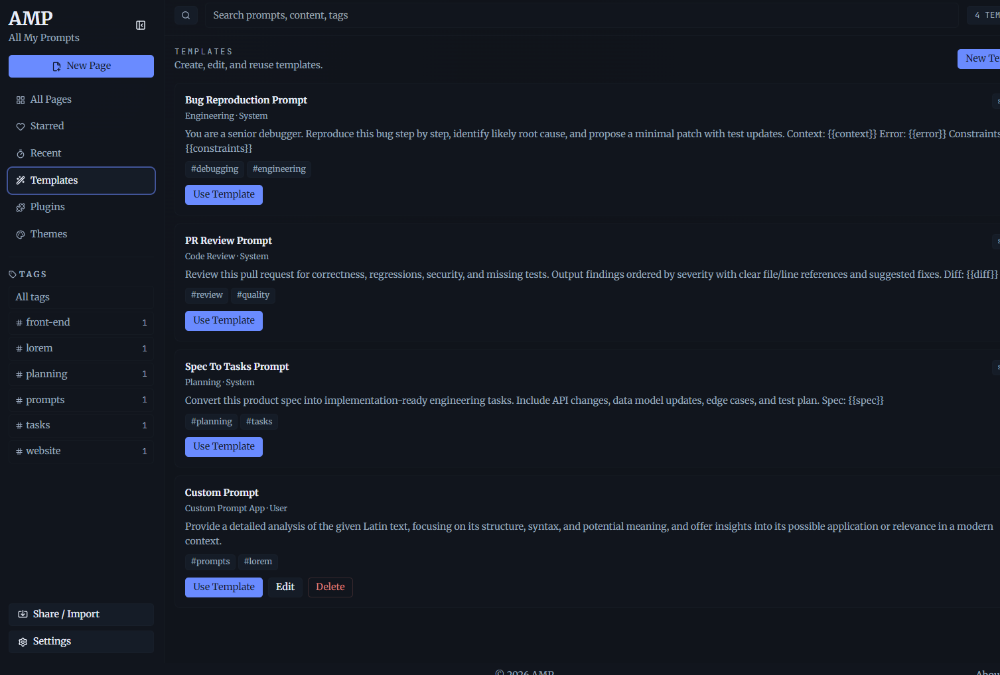

# AMP Wiki

Welcome to the official AMP developer wiki.

**AMP (All My Prompts)** is a desktop-first prompt operations platform for writing, validating, organizing, packaging, sharing, and monetizing prompts, plugins, and themes.

## Product Scope

AMP is built around one integrated workspace:

1. **Left rail**: lane navigation, folders, tags, workspace actions, settings, and marketplace entry.
2. **Center lane**: searchable prompt cards, selection workflows, quick actions, and context menu actions.
3. **Focus panel**: Summary, Read, Edit, validation, refine, sharing, and template conversion.

## What Is Documented Here

This wiki covers:

- Prompt workspace behavior and lane architecture.
- Markdown reading/editing behavior (including image handling).
- Theme and plugin packaging standards (manifest-first).
- Marketplace integration and admin distribution flow.
- Settings system and configuration references.
- Installer, release, and auto-update pipeline.

## Quick Index

- [Prompt Workspace](./Prompt-Workspace.md)
- [Themes And Plugins](./Themes-And-Plugins.md)
- [Marketplace And Admin](./Marketplace-And-Admin.md)
- [Settings Reference](./Settings-Reference.md)
- [Installation And Updates](./Installation-And-Updates.md)
- [Terms](../../terms.md)
- [Privacy](../../privacy.md)
- [Refund Policy](../../refund.md)

## Visual References

## Development Notes

- Renderer app shell uses typed settings and marketplace state.
- Prompt workflow emphasizes markdown consistency between edit/read modes.
- Marketplace assets are file-backed and validated before registration.
- Update checks use GitHub release artifacts and `latest.yml`.

## Related Repository Docs

- [README](../../README.md)
- [Contributing](../../CONTRIBUTING.md)
- [Updates](../../updates.md)
